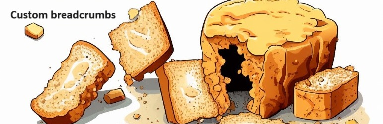

# Yoast SEO Custom Breadcrumbs

[English](README_en.md)

Версия 1.0

Плагин позволяет оформить произвольные хлебные крошки для любой отдельной страницы/записи/товара Wordpress.

> :warning: **Важно!**: Этот плагин предполагает что хлебные крошки формируются с помощью
> [Yoast SEO Plugin](https://ru.wordpress.org/plugins/wordpress-seo/)

Этот плагин никаким образом не сможет изменить хлебные крошки на вашем сайте, если они формируются с помощью темы или произвольным кодом.

## Установка плагина

1. Скачайте последнюю актуальную версию плагина [по ссылке](https://github.com/ivannikitin-com/yoast-seo-custom-breadcrumbs/releases/latest) в виде zip-архива и установите его штатным образом в WordPress Плагины -> Добавить новый -> Загрузить файл.
2. Активируйте плагин.

## Использование плагина

Для формирования хлебных крошек плагин использует заранее созданные меню. Поэтому создайте одноуровневые меню с желаемыми ссылками на любые элементы вашего сайта или даже внешние ссылки и сохраните это меню (или эти меню) с произвольным именем.

Для этого: 
1. Откройте в админке сайта Внешний вид -> Меню.
2. Нажмите на ссылку "создайте новое меню"
3. В название меню впишите "Хлебные крошки 1" (Рекомендуем всегда называть меню Хлебные крошки). 
4. Никакие галочки настроек меню не ставьте!
5. Нажмите кнопку "Создать меню"
6. В левой колонке отмечайте галочками любые элементы (страницы, записи, категории и т.п., включая произвольные ссылки!) и нажимайте "Добавить в меню" для добавления в правую колонку "Структура меню"
7. Если раскрыть добавленный элемент (стрелочка справа), то можно указать ему произвольный текст или удалить его.
8. При необходимости порядок элементов можно изменить перетаскиванием. Не делайте вложенные элементы! Меню должно быть одноуровневым!
9. Сохраните свою работу, нажав "Сохранить" в правом нижнем углу

Перейдите в любой элемент типа Страница, Запись или Товар и в мета-боксе "Хлебные крошки" выберите заранее созданное меню.

Для этого:
1. Найдите раздел (мета-бокс) с названием "Хлебные крошки" (скорее всего, он будет внизу)
2. Выберите в выпадающем списке созданное вами меню.
3. Нажмите кнопку "Обновить запись/страницу/товар" (обычно она справа-сверху)
4. Нажмите на ссылку "Просмотреть" 

Посмотрите на сайте, как отображаются хлебные крошки.

Если у элемента выбрано значение "По умолчанию", то будут использоваться хлебные крошки, сформированные Yoast SEO.

## Сообщения об ошибках и предложения по развитию плагина

Этот плагин тщательно тестировался с последней версией WordPress 6 и PHP 7.4. Однако, если вы обнаружите ошибки в его работе, автор будет признателен за сообщение о любых проблемах и любые ваши предложения. 

Вы можете оставить свои сообщения [по ссылке](https://github.com/ivannikitin-com/yoast-seo-custom-breadcrumbs/issues).

## Условия использования, распространения и модификации этого плагина

Данный плагин в виде открытого программного кода распространяется и может быть использован по условиям 
лицензии [GPL v2](https://www.gnu.org/licenses/gpl-2.0.html).
General Public License version 2 — это свободная лицензия для программного обеспечения, 
которая гарантирует пользователям четыре основные свободы:

1. Свобода использовать программный код плагина и сам плагин в любых целях.
2. Свобода изучать код плагина и адаптировать его для себя.
3. Свобода распространять копии плагина, чтобы помочь другим.
4. Свобода улучшать программный код плагина и сам плагин и публиковать улучшения, чтобы любой желающий мог ими воспользоваться.

Таким образом вы можете как угодно использовать или модифицировать этот программный код для любых целей при одном условии -- любая ваша модификация или использование этого кода также должны быть полностью открытыми (то есть предоставлять исходный код) для всех и сопровождаться явной декларацией условий GPL v2.

Все изображения, используемые в этом плагине сгенерированы нейросетью и не принадлежат никому.

## Вознаграждение автору

Автор не требует от вас никакого вознаграждения за свой труд, но от кофе не откажется!

Сканируйте этот QR-код любым банковским приложением, укажите любую сумму добровольного пожертвования автору и укажите в назначении платежа _"На кофе автору"_:

